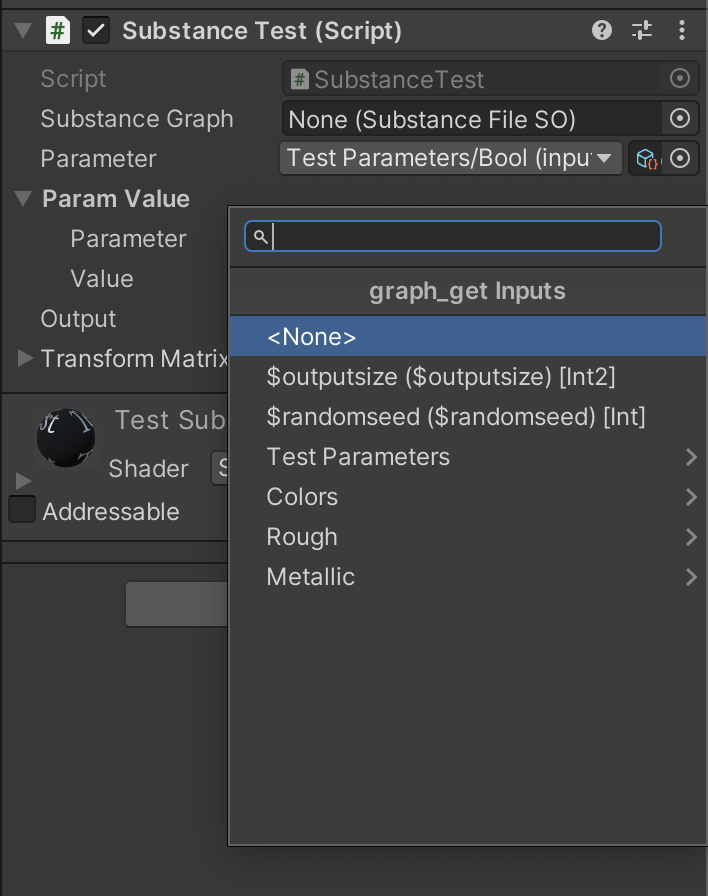
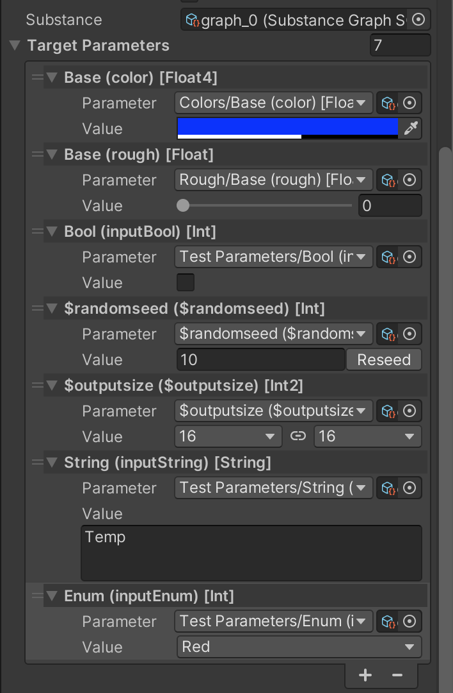
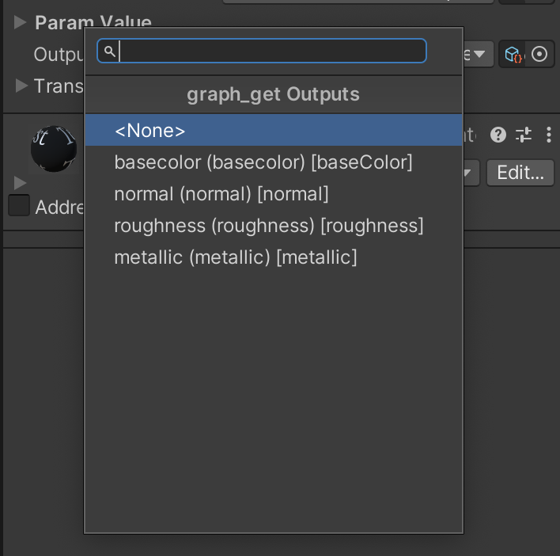

# Documentation
Welcome to the Substance 3D for Unity extensions repo documentation page! This page contains links to various classes that extend the core functionality of the Substance 3D for Unity plugin.

## Utility
These scripts make referencing and working with substance values easier.

### SubstanceParameter
Allows quick and easy selection of Substance inputs via the inspector. If an input is part of a group, it will be nested under the appropriate group name. This class stores information on the targeted input for use when getting or setting values. Parameter labels display information on the target input's identifier and type to easily tell what the input is at a glance.

<picture>
  
</picture>

### SubstanceParameterValue
Handles referencing a Substance input and displaying an appropriate value field in the inspector. The value field shown will automatically adjust to match the target input's desired widget. This includes dropdowns when targeting enum int inputs, sliders when targeting clamped float inputs, color fields when targeting Float3 or Float4 color inputs, etc. $randomseed and $outputsize inputs also have special value fields.

<picture>
  
</picture>

### SubstanceOutput
Allows easy selection of Substance output textures via the inspector. The selected output texture's identifier as specified in Substance Designer (ie "basecolor") is stored.

<picture>
  
</picture>

## Runtime
Several extension methods have been created to help make runtime Substance rendering easier to work with. Runtime rendering involves obtaining a `SubstanceNativeGraph` for a `SubstanceGraphSO` asset, setting input values on it, rendering the native graph and updating the subtance graph with the result, then disposing of that native graph when you are done rendering. To streamline this process, there are two main extension methods to use:

  - `SubstanceGraphExtensions.BeginRuntimeEditing();`
    - Handles initializing the Substance graph asset for runtime and returns the generated `SubstanceNativeGraph` reference.
    - This method caches native graphs so they can be reused easily.
  - `SubstanceGraphExtensions.EndRuntimeEditing();`
    - Removes the Substance graph's native graph from the cache and disposes of it. This frees up resources that were allocated for rendering.

After calling `substanceGraph.BeginRuntimeEditing();` you can set input values on the native graph before calling either `substanceGraph.Render(nativerGraph)` or `substanceGraph.RenderAsync(nativeGraph)` to render the Substance using the new input values. Once your render is complete, you can then call `substanceGraph.EndRuntimeEditing()` to dispose of the native graph, or you can keep a reference to it if you are going to rerender the Substance graph again.

**See the various runtime example scenes for more details on how these methods can be used.**
